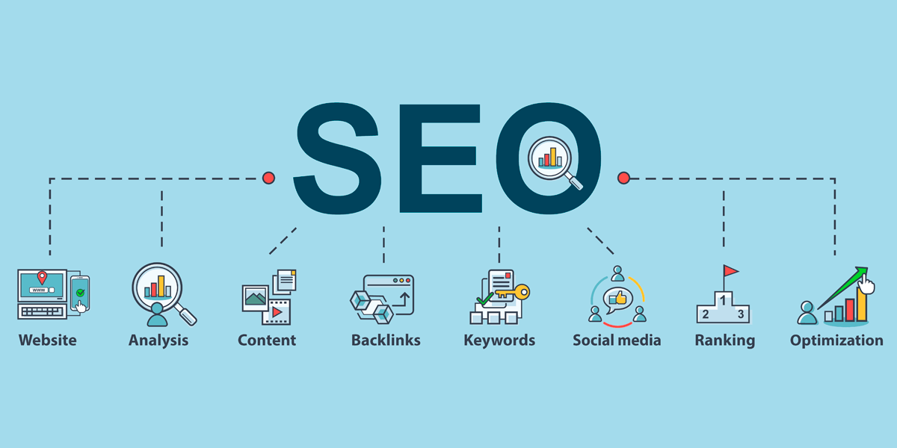

#   SEO Introduction

    

**_SEO (Search Engine Optimization)_**, is a digital marketing strategy that focuses on improving a website's visibility and ranking on search engines like Google, Bing, and Yahoo. It involves various techniques and best practices to enhance a website's content, structure, and backlinks, with the aim of achieving higher organic (non-paid) search engine results. _The ultimate goal of SEO is to drive more relevant organic traffic to a website, increasing its online presence and potential for conversions and business success_.
+ SEO is made up of two words **_Search Engine_** and **_Optimization_**.
+ _Search engine_, refers to the software system that designed to search datas and information relevant to the keywords used by the user.
+ _Optimization_, refers to making most efective use of any situation or resource.

## Job opportunities in SEO
+ SEO Specialist
+ SEO Manager
+ Content Writer/SEO copywiter
+ Link Building Specialist

## Key Skills required to become a SEO Speicialist
+ Keyword Research
+ On-Page Optimization
+ Off-Page Optimization
+ Technical SEO
+ Content Creation
+ Data Analytics
+ Html and CSS basic
+ Content Management System(CMS)
+ Local SEO
+ Digital Marketing Knowledge
