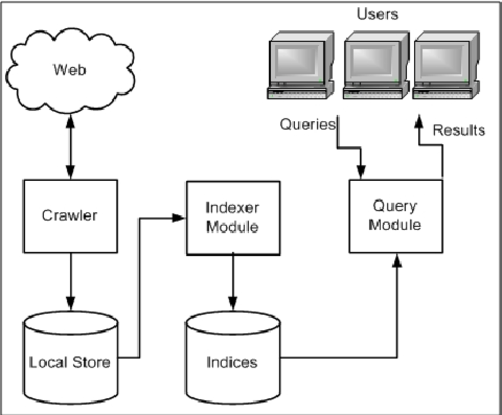

## Search Engine

**_Search Engine_**, is a web-based software application that enables users to retrieve information from the vast and interconnected world of the internet.
Users input specific keywords or phrases, and the _search engine_ uses complex algorithms to scan, index, and rank web pages and content, presenting a list of relevant results. 

    

### SERP(Search Engine Results Page)
 It refers to the page displayed by a search engine in response to a user's search query.

- **SERP Definition:** SERP stands for "Search Engine Results Page."
- **Content Variety:** It displays a variety of content types like web pages, images, videos, featured snippets, and ads.
- **Relevance:** The content is chosen by the search engine as the most relevant to the user's query.
- **Layout Variation:** SERPs can vary in layout and content based on the search engine and specific query.
- **User Interface:** It's the page where users view search results after entering search terms in a search engine.

### Top ten Search Engines are:

+ Google
+ Bing
+ Yahoo
+ Baidu(Most used in China)
+ Yandex(Most used in Russia)
+ DuckDuckGo (focused on user privacy)
+ Ask.com
+ AOL Search
+ WolframAlpha (for computational knowledge)
+ Ecosia (uses search revenue for tree planting)

    

Google uses a program called a **Crawler** or **Spider** to index web content and make it searchable on its _search engine_. 
+ The _Google Crawler (Googlebot)_ is primarily used to index and make web content searchable for users who are searching for something using keywords on the Google search engine.
+ The Google crawler (Googlebot) makes web content that would otherwise be invisible to others, or "hidden" on the internet, visible to people who use Google to search for information. 
+ By crawling and indexing websites, Googlebot allows web pages to appear in Google's search results, making them accessible to users searching for specific topics, keywords, or information.

    

1. **Googlebot's Role:** Googlebot, the Google crawler, indexes web content to make it accessible in Google's search results, ensuring that users can find relevant information when searching using keywords.

2. **User Interaction:** While Googlebot's function is critical for content discovery, it doesn't directly assist users in their keyword-based searches. Users interact with Google's search engine to access indexed content.

3. **Indirect Connection:** The connection between Googlebot and users is indirect, as Googlebot's indexing work facilitates users' ability to search for and discover web content through Google's search interface.